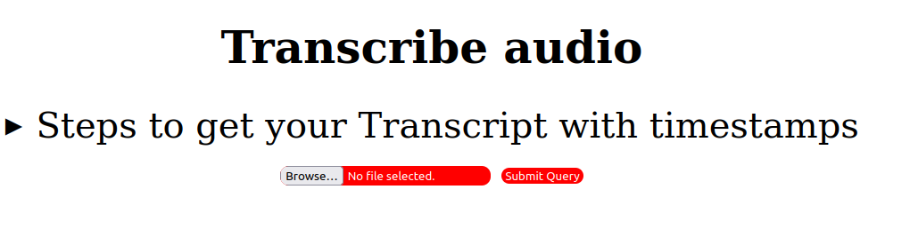
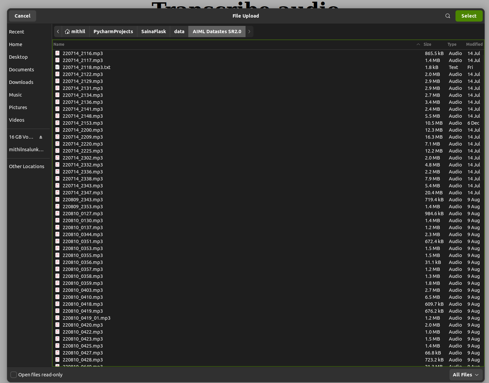
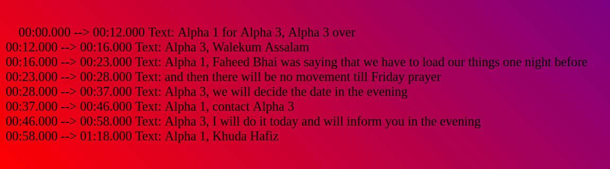
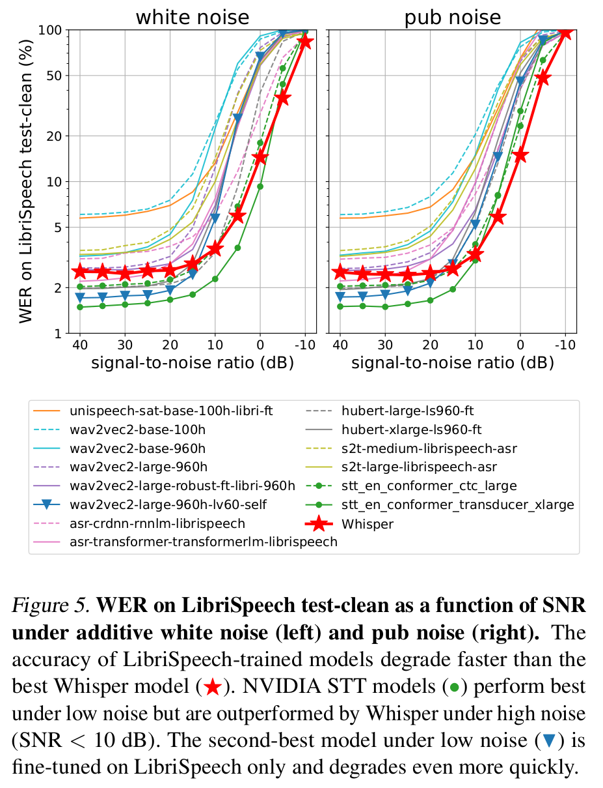
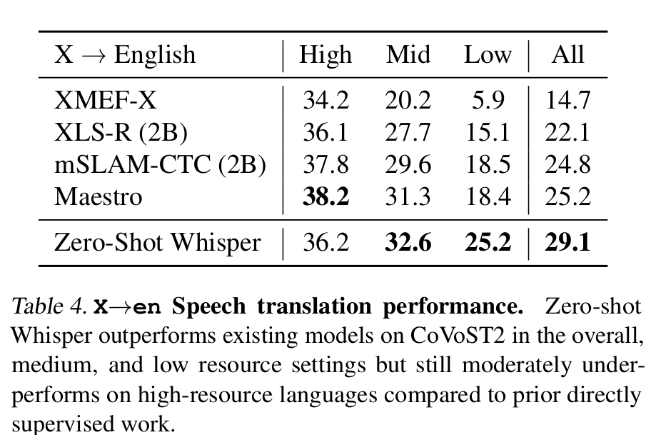
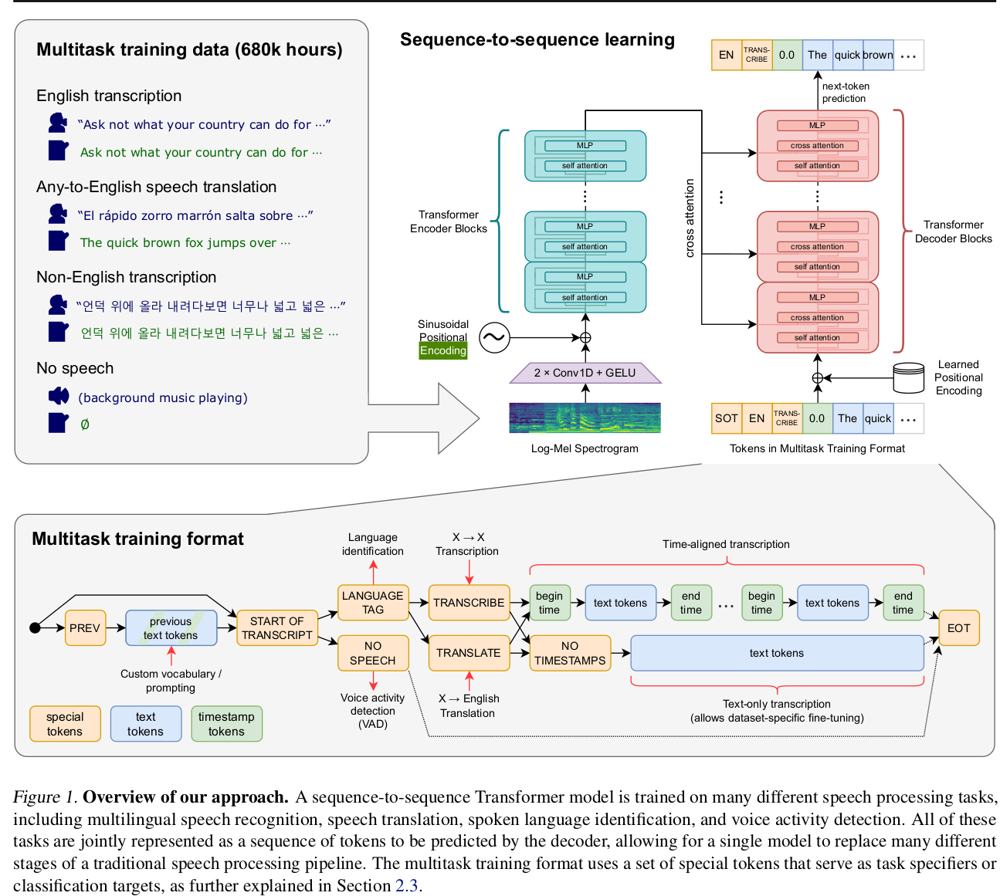

# **My Solution for Sainya Ranakshetram AI challenge**

# 1. How to View my Solution

## A. README.md

This is a README.md file for my solution for sainya-ranakshetram AI challenge. This README.md file is written in
Markdown format. You can read more about Markdown format [here](https://guides.github.com/features/mastering-markdown/).
There are Two ways in which you can read this README.md file

### Option 1: Read this README.md file on using grip ( GitHub markdown previewer)

To render this readme.md , open the terminal and cd into this directory and run the following command in a bash shell to
install
grip

``` bash
cd wheels  
pip install 'grip-4.6.1-py3-none-any.whl' --no-index --find-links '.' 
cd ..
```

Then Run to view this README.md file in your browser

```bash
grip
```

which will give the following output:

```bash
* Serving Flask app 'grip.app'
* Debug mode: off
WARNING: This is a development server. Do not use it in a production deployment. Use a production WSGI server instead.
* Running on http://localhost:6419
Press CTRL+C to quit
```

Click on the link http://localhost:6419 to view the rendered README.md file.

Incase you are running this solution on a remote server, you can forward the port 6419 to a remote tunnel using
cloud-flared tunneling service.
To do so, run the following command in a bash shell:

```bash
cloudflared tunnel --url http://localhost:6419
```

this will give the following output:

```bash
2022-12-22T11:28:34Z INF Thank you for trying Cloudflare Tunnel. Doing so, without a Cloudflare account, is a quick way to experiment and try it out. However, be aware that these account-less Tunnels have no uptime guarantee. If you intend to use Tunnels in production you should use a pre-created named tunnel by following: https://developers.cloudflare.com/cloudflare-one/connections/connect-apps
2022-12-22T11:28:34Z INF Requesting new quick Tunnel on trycloudflare.com...
2022-12-22T11:28:36Z INF +--------------------------------------------------------------------------------------------+
2022-12-22T11:28:36Z INF |  Your quick Tunnel has been created! Visit it at (it may take some time to be reachable):  |
2022-12-22T11:28:36Z INF |  Url Here (unique url will be created here every time)                                             |
2022-12-22T11:28:36Z INF +--------------------------------------------------------------------------------------------+
2022-12-22T11:28:36Z INF Version 2022.12.1
2022-12-22T11:28:36Z INF GOOS: linux, GOVersion: go1.19.3, GoArch: amd64
2022-12-22T11:28:36Z INF cloudflared will not automatically update if installed by a package manager.
2022-12-22T11:28:36Z INF Generated Connector ID: a3eea567-7fe4-4f24-bbab-eaba6e003265
2022-12-22T11:28:36Z INF Initial protocol quic
2022-12-22T11:28:36Z INF ICMP proxy will use 10.42.32.18 as source for IPv4
2022-12-22T11:28:36Z INF ICMP proxy will use :: as source for IPv6
2022-12-22T11:28:36Z INF Starting metrics server on 127.0.0.1:42055/metrics

```

The Url Here area will have your unique url. Click on the link to view the rendered README.md file.

### Option 2: Read README.pdf

You can open a rendered pdf of README.md By opening the file README.pdf in this directory.

## B. Video

You can also view the video of my solution [here](https://youtu.be/1Z4Z2Z2Z2Z2) ## ADD video link here

# 2. How to Run my solution

## Step 1 : Make sure All requirements are installed

### Docker

To check this run the following command in a bash shell

```bash
docker --version
```

If this command runs successfully then you have docker installed on your system. If not then install docker using the
following command

```bash
bash install_docker.sh
```

Which will install docker on your system

### Compute Requirements

This Repo requires an Nvidia GPU with a minimum of 10GB of memory to run to fit the transcription model.

### Audio File Requirements

The Audio File passes should be in either of the following formats:

- .wav
- .mp3
- .m4a
- .flac
- .ogg
- .aac
- .avi

more might be supported but these are the ones that I have tested.

## Step 2 : Clone the Docker container

To clone the docker container run the following command in a bash shell

```bash
sudo docker pull mithilaidocker/audiotranscribe:master
```

## Step 3 : Run the Docker container

To run the docker container run the following command in a bash shell

```bash
sudo docker run --gpus all --ipc=host --ulimit memlock=-1 --net="host" --ulimit stack=67108864 -it -v "/home/":/home \
--rm mithilaidocker/audiotranscribe:master
```

By running this command you will enter the docker container.

## Step 4 : Run the Solution

### Option 1 : Using the GUI in the form of a Flask Web Server

#### Step 1 : Run the Flask Web Server

To Run the flask app for the solution run the following command in a bash shell.(Make sure you are in the `/app` dir)

```bash
root@xx:/app#  python -m flask run --host 0.0.0.0
```

This will run the flask app which contains the solution. The command will give the following output

```bash
* Debug mode: off
WARNING: This is a development server. Do not use it in a production deployment. Use a production WSGI server instead.
* Running on all addresses (0.0.0.0)
* Running on http://127.0.0.1:5000
* Running on http://10.42.32.18:5000 #Use the url printed here.  It would be different depending upon your IP address
Press CTRL+C to quit
```

If you are running on the same machine as the server then you can access the solution at http://127.0.0.1:5000.
In case you running this solution on a remote server you will need to forward the port 5000 to your local machine. To do
this
we can use cloudfared tunnel (_already installed on the docker image_) to forward the port 5000 to our local machine. To
do this run the following command in a bash shell

```bash
cloudflared tunnel --url http://10.42.32.18:5000 # again this will be different depending upon your IP address. 
# Make sure that you use the IP address printed in the output of the previous command

```

Which will Give the following output

```bash
2022-12-22T11:28:34Z INF Thank you for trying Cloudflare Tunnel. Doing so, without a Cloudflare account, is a quick way to experiment and try it out. However, be aware that these account-less Tunnels have no uptime guarantee. If you intend to use Tunnels in production you should use a pre-created named tunnel by following: https://developers.cloudflare.com/cloudflare-one/connections/connect-apps
2022-12-22T11:28:34Z INF Requesting new quick Tunnel on trycloudflare.com...
2022-12-22T11:28:36Z INF +--------------------------------------------------------------------------------------------+
2022-12-22T11:28:36Z INF |  Your quick Tunnel has been created! Visit it at (it may take some time to be reachable):  |
2022-12-22T11:28:36Z INF |  Url Here (unique url will be created here every time)                                             |
2022-12-22T11:28:36Z INF +--------------------------------------------------------------------------------------------+
2022-12-22T11:28:36Z INF Version 2022.12.1
2022-12-22T11:28:36Z INF GOOS: linux, GOVersion: go1.19.3, GoArch: amd64
2022-12-22T11:28:36Z INF Settings: map[protocol:quic url:http://127.0.0.1:5000]
2022-12-22T11:28:36Z INF cloudflared will not automatically update if installed by a package manager.
2022-12-22T11:28:36Z INF Generated Connector ID: a3eea567-7fe4-4f24-bbab-eaba6e003265
2022-12-22T11:28:36Z INF Initial protocol quic
2022-12-22T11:28:36Z INF ICMP proxy will use 10.42.32.18 as source for IPv4
2022-12-22T11:28:36Z INF ICMP proxy will use :: as source for IPv6
2022-12-22T11:28:36Z INF Starting metrics server on 127.0.0.1:42055/metrics
```

Click on the link in the area of the output that says `Url Here` to view the solution. You will have your own unique url
every time
**_NOTE:_** The Cloudflare tunnel is only a quick way to access the solution. It is not a production ready solution. If
you want to use this solution in production you should use a pre-created named tunnel by
following: https://developers.cloudflare.com/cloudflare-one/connections/connect-apps

#### Step 2 : How to use the Flask App

Upon opening the url you will be greeted with the following page

Steps To Transcribe The Audio File are following from here

1. Click on the `Choose File` or the `Browse` button to select the audio file you want to transcribe. The following
   window will open on
   Linux
   

2. Select the audio file which are in the supported audio formats you want to transcribe and click on `Select`(or any
   other button
   you get depending upon your os).
3. The file name will be displayed in the `File Name` text box
   Example -
   
4. Click on the `Submit Query` button to start the transcription process.
   **_NOTE:_** The Submit Query Button can have a
   different name depending upon the browser you are using. For example in Firefox it is `Submit Query` but in Chrome it
   is `Submit`
5. The transcription process will take some time depending upon the length of the audio file and the type of GPU you
   have. It is important not close the web page once clicking upon the `Submit Query` button. Once the process is
   complete you will be greeted with the result page. Let us take an example of the following
   audio file.
   [221001_0134.mp3](221001_0134.mp3)
6. The result page will look like this for the following audio file is transcribed
   
7. The Transcript will be saved in the `/home/transcripts` directory in the docker container. The file name will be the
   same as the audio file name with the extension `.txt`. So for the above example the transcript will be saved in the
   `/home/transcripts/221001_0134.txt` file.
8. You can print the txt file following command in the docker container

```bash
root@xx:/app# cat /home/transcripts/YourAudioFile.txt
```

With the 221001_0134.txt file being the name of the audio file you want to transcribe.

### Option 2 : Using the CLI

Using the CLI is much more straightforward. To run the CLI for the solution run the following command in a bash shell.(
Make sure you are in the `/app` dir)

```bash
root@xx:/app#  python model.py --path your_audio_file 
```

Let us use the same file we used above for the flask App as an example
[221001_0134.mp3](221001_0134.mp3)
so here the command will be

```bash
root@xx:/app#  python model.py --path 221001_0134.mp3 
```

which would give us the following output

```bash
Transcribing... 221001_0134.mp3
Detecting language using up to the first 30 seconds. Use $(--language) to specify the language
Detected language: Urdu
[00:00.000 -- Alpha 1 for Alpha 3, Alpha 3 over >00:12.000]
[00:12.000 -- Alpha 3, Walekum Assalam >00:16.000]
[00:16.000 -- Alpha 1, Faheed Bhai was saying that we have to load our things one night before >00:23.000]
[00:23.000 -- and then there will be no movement till Friday prayer >00:28.000]
[00:28.000 -- Alpha 3, we will decide the date in the evening >00:37.000]
[00:37.000 -- Alpha 1, contact Alpha 3 >00:46.000]
[00:46.000 -- Alpha 3, I will do it today and will inform you in the evening >00:58.000]
[00:58.000 -- Alpha 1, Khuda Hafiz >01:18.000]
Transcription complete. Saved it to /home/transcripts/221001_0134.txt

```

the transcript will be saved in the `/home/transcripts` directory in the docker container. The file name will be the
same as the audio file name with the extension `.txt`. So for the above example the transcript will be saved in the
`/home/transcripts/221001_0134.txt` file.
You can print the txt file following command in the docker container

```bash
root@xx:/app# cat /home/transcripts/YourAudioFile.txt
```

so here the YourAudioFile.txt will be the name of the audio file we are transcribing so for the above example it will be
221001_0134.txt

**_NOTE:_** You can also pass multiple paths to the `--path` argument. For example if you want to transcribe 2 audio

```bash
root@xx:/app# python model.py --path 221001_0134.mp3 221001_0135.mp3
```

# 3. What is my solution

## 3.1. Problem statement

**The challenge aims to develop a software-based tool that is able to ingest
radio audio recordings (non HiFi) in common format of (.wav, FLAC, MP3 (high bit
rate) etc.) containing information in a mix of English and Hindi (Hinglish) with limited
use of local slang's and create an extract transcript information output in textual
format. This problem intrinsically contains the task of cleaning of raw audio signals,
shaping of signals and creating algo specific data required by the NLP engine.**

## 3.2 Transcribing and Translating Noise-filled Audio Recordings Containing Multiple Languages and Dialects: A Unique and Difficult Challenge

**As we embark on the challenge of transcribing and translating audio recordings that are full of noise and contain a
mix
of multiple languages and dialects, we quickly realize that we're facing a unique and difficult task. Not only are the
audio files we're working with low quality, with a high percentage of noise relative to signal, but they also contain
slang's and local words that aren't present in any dataset and can't be easily translated using standard language
models.**

**And even when we are able to translate words, we face the added challenge of context-dependent translations that don't
always have a straightforward one-to-one correspondence. For example, the word "Bhai" could be translated as "Brother"
or "Friend" depending on the context.**

**But that's not all - we also need to provide timestamps for the words in the audio file, a critical feature that will
help users navigate and find the specific parts of the audio file they're looking for. All of these challenges combine
to make this task a truly distinctive and challenging one, but with the right tools and approaches, we're confident we
can
rise to the challenge and deliver the best possible results.**

## 3.3 Model Selection

**As we set out to solve the challenge of transcribing and translating audio recordings that have been distorted and
compressed for transmission over the airwaves, it quickly becomes apparent that we need a model that is up to the task.
The input audio will be of low quality, with a restricted frequency range and the added complications of channel noise,
dialects and slang's. To successfully extract and transcribe this information, we need a model that is capable of
handling these challenges and producing high-quality results.**

**One of the key challenges we face in this task is the high level of noise and low signal-to-noise ratio in the audio
recordings we're working with. This can make it difficult to accurately transcribe and translate the content of the
audio files, as the noise can obscure the words and make them harder to understand. That's where OpenAI Whisper Large-V2
comes in. Whisper Large-V2 is a state-of-the-art machine learning model that has been specifically designed to excel at
handling audio files with high levels of noise and low signal-to-noise ratios. Its extensive training on a dataset of
680,000 hours of audio in 100 languages (as a point of comparison, GigaSpeech , which comes 2nd place to Whisper in
terms of training data is trained on only 44,000 hours of audio ), including non-ideal, noisy samples, has prepared it
to tackle the unique challenges of our task.**

**But the benefits of Whisper Large-V2 don't end there. It is also a zero-shot learning model, meaning that it can
perform tasks and make predictions without the need for any fine-tuning or additional training on specific datasets.
This makes
it a highly efficient and effective choice for our needs, as we can rely on it to deliver reliable results from the
get-go, without the need to invest time and resources into adapting it to the specifics of our task. In fact, Whisper
Large has a SOTA (state-of-the-art) performance in this type of scenario, making it the ideal model for transcribing and
translating audio files that are full of noise and contain a mix of multiple languages and dialects**

**Whisper Large-V2 has been trained for 2.5 times more epochs than Whisper Large-V1, with SpecAugment, stochastic depth,
and BPE dropout for regularization. Other than the training procedure, the model architecture and size remained the same
as the original large model**

**But why did we choose the large-v2 version of Whisper instead of the medium or small models? The answer is simple: the
large version provides the best
balance of accuracy and speed for our needs. While the medium and small models may be able to handle some tasks
required for this challenge, they don't offer the same level of proficiency as the large model. Plus, the large model is
able to run efficiently on a GPU, making it a convenient and resource-saving choice. Overall, OpenAI Whisper Large-V2 is
an excellent choice for our task of transcribing and translating audio recordings. Its
extensive training, zero-shot learning capabilities, and proficiency in handling multiple languages make it well-suited
to the novelocity modelchallenges of this task, and its large size ensures that it delivers the best possible balance of
accuracy and speed. We can trust Whisper Large-V2 to deliver reliable, high-quality results efficiently and effectively,
making
it the ideal model for this challenge**

Some figures from the official paper which shows the performance of the model


**_NOTE:_** Since all the languages in this dataset come under low-resource or mid-resource this is not a problem
